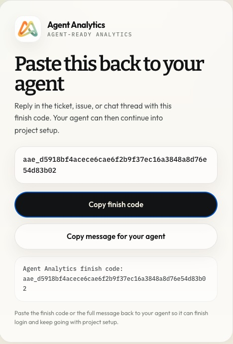

For OpenClaw, the cleanest path is the hosted ClawHub skill. It keeps setup agent-native while using the same underlying analytics surface the CLI and API expose.

If you are setting this up from a 📎Paperclip company, use [Set up Agent Analytics for your 📎Paperclip company](/guides/paperclip/) for the company-skill path. Use this page when you need the raw OpenClaw install flow itself.

The important detail: `npx` is only the launcher. The skill is using the official Agent Analytics CLI, and that CLI wraps the same documented HTTP API shown in the docs.

## Prerequisites

- An Agent Analytics account at [app.agentanalytics.sh](https://app.agentanalytics.sh)
- Access to the OpenClaw environment where you want the skill installed
- `npx` available in that runtime

## Recommended: install from ClawHub

Tell OpenClaw:

> Please install Agent Analytics from ClawHub:
> `npx clawhub@latest install agent-analytics`

The hosted listing is here:

- [Agent Analytics on ClawHub](https://clawhub.ai/dannyshmueli/agent-analytics)

Once installed, OpenClaw can create projects, generate tracking snippets, query stats, inspect funnels, and manage experiments from the same conversation loop.

Then ask OpenClaw:

> Set up Agent Analytics for this project. Install it here if needed. If approval is needed, send me the link and wait. I will sign in with Google or GitHub, and if needed I will paste back any finish code. Then create the project, add tracking and key events, and verify the first event.

The normal OpenClaw path is:

1. install the skill
2. ask OpenClaw to set up the project
3. let OpenClaw send the browser approval link
4. sign in in the browser
5. paste back the finish code in the same thread
6. let OpenClaw continue into project setup and first-event verification

In headless OpenClaw environments, this finish-code handoff is the normal login path. The browser page should look like this:

The public docs still matter because they show exactly what the skill is wrapping:

- [CLI vs MCP vs API](/reference/cli-mcp-api/)
- [API Reference](/api/)

That is the right explanation if a security review asks what the `npx` command is doing.

## Verify the install

Ask OpenClaw:

- `Set up Agent Analytics for this project. Install it here if needed. If approval is needed, send me the link and wait. I will sign in with Google or GitHub, and if needed I will paste back any finish code. Then create the project, add tracking and key events, and verify the first event.`
- `How is my-site doing this week?`
- `Send me a daily analytics summary every morning`

If you have not created your first real project yet, continue with [First Project in 5 Minutes](/guides/first-project-in-5-minutes/).

## Troubleshooting

- If ClawHub flags the skill because of `npx`, point reviewers to [CLI vs MCP vs API](/reference/cli-mcp-api/) and [API Reference](/api/). The CLI is the official wrapper around those documented endpoints.
- If OpenClaw sends you an approval link but never resumes, paste the finish code back into the same thread.
- If the skill installs but cannot query data after login, confirm the browser approval completed with the same Agent Analytics account you expect to use.
- If you intentionally choose the advanced/manual API-key path, keep `AGENT_ANALYTICS_API_KEY` in the OpenClaw runtime instead of pasting it into chat.
- If you need endpoint-level debugging, use the [API reference](/api/) with `curl` before returning to the skill flow.

## Related

- [Getting Started](/getting-started/)
- [Set up Agent Analytics for your 📎Paperclip company](/guides/paperclip/)
- [First Project in 5 Minutes](/guides/first-project-in-5-minutes/)
- [Claude Code](/installation/claude-code/)
- [OpenAI Codex](/installation/openai-codex/)
- [API Reference](/api/)
